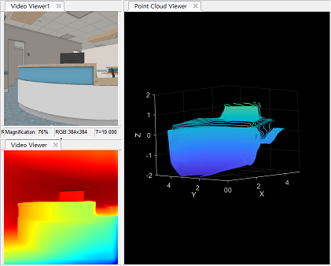

# Monocular-Depth-Estimation
 Monocular Depth Estimation for indoor environment with MATLAB

This repository contains the MATLAB project which computes depth map from a single image and transforms into point cloud.





## Installation ##

Download ZIP file and run main script
```shell
    run('main.mlx');
```
Run training script only for training network
```shell
    run('train_net.mlx');
```
Dataset not included. Download [NYU v2 dataset](https://cs.nyu.edu/~silberman/datasets/nyu_depth_v2.html) 

### Dependencies ###
MATLAB
* Deep Learning Toolbox
* Computer Vision Toolbox
* Statics and Machine Learning Toolbox
* Lidar Toolbox

Simulink
* Robotics System Toolbox
* Automated Driving Toolbox
* ROS Toolbox
* PackageGazeboPlugin (from Gazebo Simulation Environment Requirements and Limitations )

Device
* Ubuntu® Ubuntu 20.04.3 LTS (Focal Fossa)
* CMake 3.16.3, Gazebo 11, and the Gazebo plugin


## Usage ##
1. Load downloaded dataset and Check
2. Design the network using DeepNetworkDesigner
3. Train the network using training option in DeepNetwrokDesigner, and then Save the trained network in the directory.
4. Load the trained network and test in MATLAB
5. Load the network in Simulink and Connect the simulation with Gazebo
